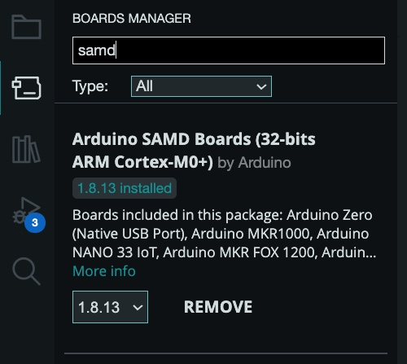
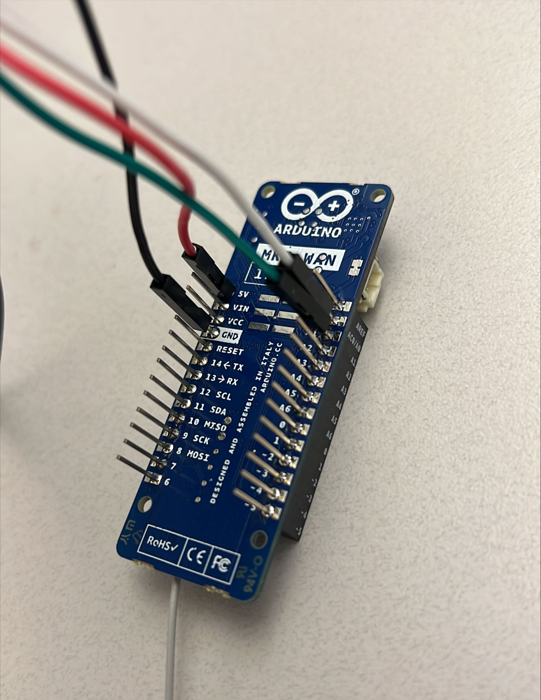

# LoraWan Soil Sensor, a MKR WAN 1310 CSU Soil Sensor

This repo shows how to connect a CSU soil sensor to a MKR WAN 1310 to give the sensor the ability to communicate via LoraWAN.

- This project was build off of work done by [amalaquias](https://github.com/amalaquias).
    - https://github.com/waggle-sensor/summer2022/tree/main/aldo

---

## Table of Contents
1. Hardware Needed
1. Installing Software
1. Connecting MKR WAN 1310 to Sensor
1. Connect MKR WAN 1310 to Computer
1. Testing Soil Sensor Using Chirpstack

## Hardware Needed

- Micro USB Wire (other end must be able to connect to your computer)
- [Arduino MKR WAN 1310](https://store-usa.arduino.cc/products/arduino-mkr-wan-1310?selectedStore=us)
- Modified Colorado State University soil sensor with four jumper wires with female input
- LoRaWAN Gateway
    - we used [Rak Discover Kit 2](https://store.rakwireless.com/products/rak-discover-kit-2?variant=39942870302918)

## Installing Software

1. To connect to the MKR WAN 1310 board, you will need to install the [Arduino IDE](https://support.arduino.cc/hc/en-us/articles/360019833020-Download-and-install-Arduino-IDE)
1. Once you installed the IDE, you need to further install the board's software support by following the [SAMD21 core for MKR boards Documentation](https://docs.arduino.cc/software/ide-v1/tutorials/getting-started/cores/arduino-samd)

   
1. You will also need the library for mkrwan. Under Library Manager, look up "mkrwan" and install "MKRWAN by Arduino".

   
    
    >NOTE: At the time of configuring the board MKRWAN_v2 was not used because of bug issues related to the library.

## Connecting MKR WAN 1310 to Sensor

1. Grab the soil sensor

    

2. Connect the wires from the sensor to the MKR WAN 1310 as shown:

    

    > Note: red wire is for power, black is for ground, white for soil moisture, and blue for soil temperature

## Connect MKR WAN 1310 to Computer

1. Connect the board to your computer with the Micro USB wire
   1. You should see a green light glow on the board
1. Go to Tools in Arduino IDE and select `FILL OUT` for Board and select the correct serial port for the arduino as shown:

    `IMAGES GO HERE`

## Testing Soil Sensor Using Chirpstack

[Chirpstack](https://www.chirpstack.io/) was used to setup our LoRaWAN network and a RAK Discover Kit 2 was used as our Gateway.

1. Retrieve your MKR WAN 1310's DevEUI by using `main.ino` in your `Arduino IDE`. The serial monitor will display your DevEUI.

    

    >NOTE: The program will fail because the device hasn't been given an App key

1. Using Chirpstack's UI, add your device using `OTAA` following [Chirpstack's Documentation](https://www.chirpstack.io/docs/guides/connect-device.html)

1. Once you've added your device, generate an application key or create one via the 'OTAA Keys' tab.

    
